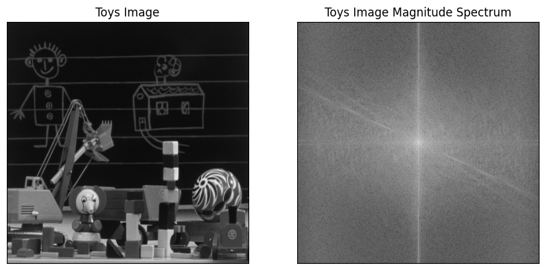
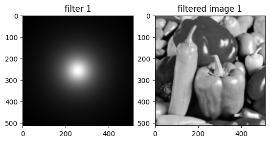
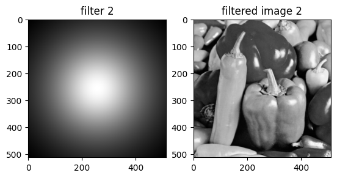
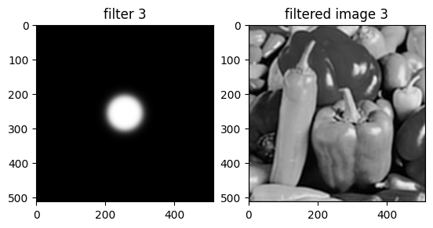
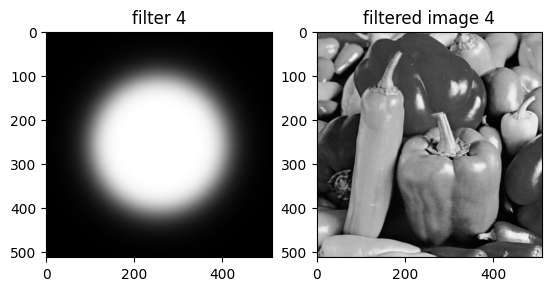
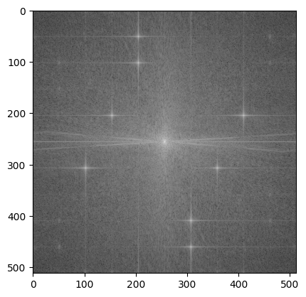
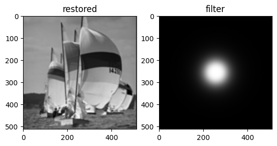
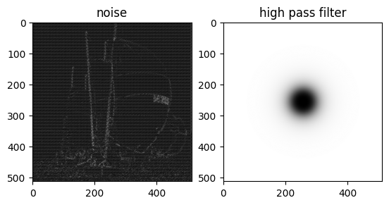
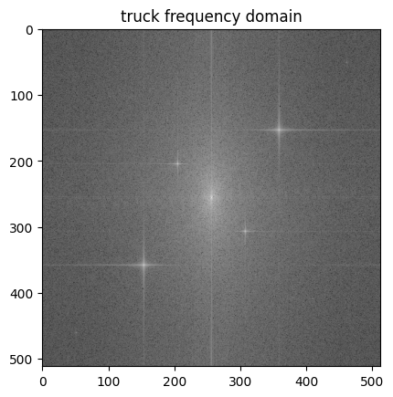
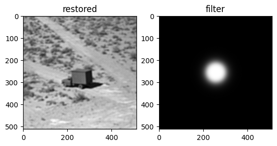

Contents

[1. Introduction](#introduction)

[2. Questions](#questions)

[2.1. Fourier Image Transform And Calculate Magnitude Spectrum](#fourier-image-transform-and-calculate-magnitude-spectrum)

[2.1.1. Description](#description)

[2.1.2. Methodology](#methodology)

[2.2. Ringing Effect Analyze](#ringing-effect-analyze)

[2.2.1. Description](#description-1)

[2.2.2. Methodology](#methodology-1)

[2.3. Restoring Periodic Noise](#restoring-periodic-noise)

[2.3.1. Description](#description-2)

[2.3.2. Methodology](#methodology-2)

[2.4. Restoration Periodic noise and Calculating PSNR](#restoration-periodic-noise-and-calculating-psnr)

[2.4.1. Description](#description-3)

[2.4.2. Methodology](#methodology-3)

[3. Conclusion](#conclusion)

# Introduction

Image processing in the frequency domain involves transforming an image from its spatial representation to its frequency representation using techniques like the Fourier Transform. By doing this, we can analyze and manipulate the image's frequency components, which can be useful for tasks such as filtering, enhancement, and compression.

# Questions

## Fourier Image Transform and Calculate Magnitude Spectrum

### Description

In this question we are tasked to preform Fourier transform on an image and calculate and show in the magnitude spectrum.

### Methodology

We use Numpy fft function to preform Fourier Transform and shift function to shift the transform result after that by using a log transform we can visualize the frequency domain.

The results can be seen in figure below. (Fig 1)

Fig 1

## Ringing Effect Analyze

### Description

For the image pepper.jpg, it is required to study the ringing effect of the Butterworth lowpass filter. Design the following filters and investigate the effect of changing the filter order and cutoff frequency on ringing. You need to display the filtered images and the shape of the filters in the spatial domain. A cross-sectional view of the filters in the spatial domain is required. Make sure to display the figures in a neat and organized way.

### Methodology

Butter-worth Filter is a filter that reduces the ringing effect very much and after applying the filters with the specified parameters there aren’t much ringing to be seen. The results after applying the filters and their respective filter can be seen in figures below. (Fig 2-5)

Fig 2

Fig 3

Fig 4

Fig 5

## Restoring Periodic Noise

### Description

Compute and display the magnitude spectrum of the image.

Investigate the image in the spatial and frequency domains and determine the type of noise that is corrupting the image.

Design the proper filter and use it to restore the original image.

Based on the filter in part C, can you display the noise component in the spatial domain? If so, show the image that represents the noise.

### Methodology

We can display the magnitude spectrum of image using the method in question 1 and results are available in figure below. (Fig 6)

Fig 6

After Investigation on the frequency domain we can determine that the noise is periodic noise and can be removed using a butter-worth filter using order 2 and cutoff-frequency 50, the result of restoration and respective filter are represented in Fig 7.

Fig 7

To find the noise component of the image we can use the high-pass version of the used Butterworth filter, the noise component and the respective filter are represented in Fig 8.

Fig 8

## Restoration Periodic noise and Calculating PSNR

### Description

Display the magnitude spectrum of the image.

Determine the type of noise in the frequency domain.

Can you remove the noise? Which type of filter is needed?

Display the noise-removed image and compute the PSNR of the image

### Methodology

The magnitude spectrum can be seen below. (Fig 9)

Fig 9

Again the filter is of type periodic and is removed using a Butterworth filter with order 3 and cutoff-frequency 45, result of restoration and respective filter represented in Fig 10.

Fig 10

PSNR stands for Peak Signal-to-Noise Ratio, a widely used metric to measure the quality of a reconstructed or compressed image compared to its original version. PSNR is typically expressed in decibels (dB), and a higher PSNR indicates better image quality.

Before calculating PSNR, we need to compute the Mean Squared Error between the original and the reconstructed image. MSE measures the average of the squared differences between corresponding pixel values in the two images.

PSNR Calculation: Once we have the MSE, we can calculate the PSNR using the formula:

$$
P S N R = 10 \cdot \log 10 \left( \frac{{M A X}^{2}}{M S E} \right)
$$

Here, MAX represents the maximum possible pixel value of the image. For an 8-bit image, MAX is 255.

A higher PSNR value indicates that the reconstructed image is closer to the original, meaning it has less distortion or noise. Generally, a PSNR value above 30 dB is considered good quality, but this can vary depending on the application and context.

PSNR is widely used in image processing and compression to evaluate the performance of algorithms and assess the visual quality of images

The PSNR of the restored image is : 28.690692217733353

# Conclusion

In conclusion, image processing in the frequency domain offers a powerful approach to analyze and manipulate images by transforming them into their frequency components using techniques like the Fourier Transform. This method allows for efficient filtering, noise reduction, and enhancement by selectively targeting specific frequency ranges. By leveraging the frequency domain, we can achieve results that are often difficult or impossible to obtain through spatial domain processing alone. Understanding and utilizing frequency domain techniques provide a deeper insight into the structure and characteristics of images, enabling the development of advanced and effective image processing algorithms.
